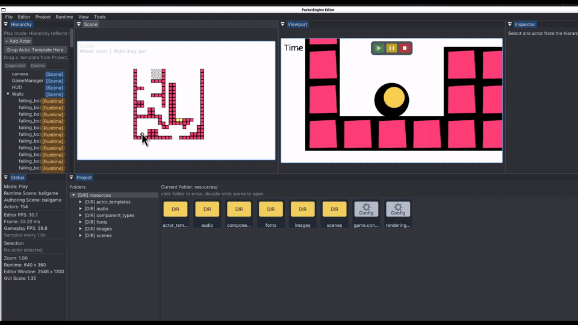

#  PocketEngine 

PocketEngine is a cross-platform 2D runtime + editor game engine, written in C++17 on top of
SDL2, Lua, Box2D, Dear ImGui, and JSON scene assets. It hosts Lua for game logic scripting.
It is a variant of the [A2 Engine](https://a2engine.org/). For basic usage, check the documentation of A2 engine for the APIs.

PocketEngine Lua API documentation lives here:
- local source: [docs/lua-api/index.md](docs/lua-api/index.md)
- GitHub Pages: https://qiulinfan.github.io/pocketEngine/

> Below is a demo of the editor and runtime in action, running the example
> "ball game" included in `resources/`. This example game originates from the
> [A2 Engine](https://a2engine.org/) ecosystem.



The game has a Unity-like editor layout and runtime integration with:
- `SceneView` panel with actor-picking and drag&drop editing;
- embedded `Viewport` panel for pure runtime output;
- `Project` browser rooted at `resources/` with scene opening and asset drag&drop support;
- `Hierarchy` tree with create, duplicate, delete, rename, actor reparenting;
- `Inspector` for component add/remove/rename and property editing
- actor parenting with local/world `Transform` and physics hierarchy inspection
- play-mode live editing and automatic scene-backed actor UID persistence

## Build
### Linux Release

```bash
cmake --preset unix-makefiles-release
cmake --build --preset unix-makefiles-release -j4
```

## Repository Layout and Architecture

- `src/app/runtime`, `src/app/editor`: executable hosts
- `src/engine/*`: runtime systems
- `src/editor/*`: editor shell, documents, panels
- `src/shared/*`: config, scene format, resource helpers
- `include/*`: public headers for the same layers
- `resources/*`: project-facing assets
- `.engine/*`: editor-facing config, state, fonts, and icons
- `thirdparty/*`: dependencies

All files under `docs/architecture/` are diagram-only for explaining the architecture.
- [Frame Pipeline](docs/architecture/frame-pipeline.md)
- [Asset Pipeline](docs/architecture/asset-pipeline.md)
- [Module Dependency](docs/architecture/module-dependency.md)
- [Editor Workflow](docs/architecture/editor-workflow.md)

## Docs

```bash
make docs-build
make site-build
make docs
```

- `make docs-build` builds the MkDocs-managed Lua API documentation only
- `make site-build` assembles the full Pages site
- `make docs` assembles the site and pushes it to `gh-pages`

## License

PocketEngine is released under the [MIT License](LICENSE).

Third-party libraries under `thirdparty/` keep their own upstream licenses.
