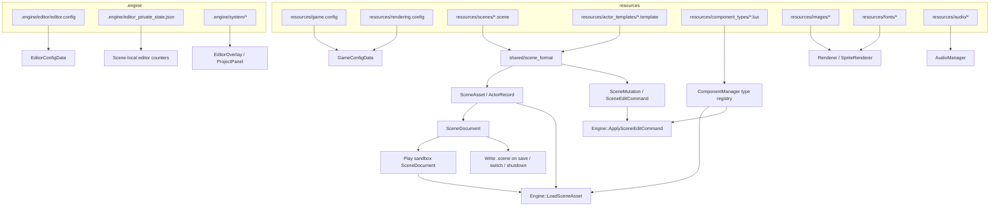

```mermaid
flowchart TD
    subgraph EnginePrivate[".engine"]
        EditorConfigFile[".engine/editor/editor.config"]
        EditorPrivateState[".engine/editor_private_state.json"]
        EditorSystemAssets[".engine/system/*"]
    end

    subgraph ProjectAssets["resources"]
        GameConfigFile["resources/game.config"]
        RenderingConfigFile["resources/rendering.config"]
        SceneFile["resources/scenes/*.scene"]
        TemplateFile["resources/actor_templates/*.template"]
        ComponentScripts["resources/component_types/*.lua"]
        Images["resources/images/*"]
        Fonts["resources/fonts/*"]
        Audio["resources/audio/*"]
    end

    GameConfigFile --> GameConfigData["GameConfigData"]
    RenderingConfigFile --> GameConfigData
    EditorConfigFile --> EditorConfigData["EditorConfigData"]
    EditorPrivateState --> SceneCounters["Scene-local editor counters"]
    EditorSystemAssets --> EditorOverlay["EditorOverlay / ProjectPanel"]

    SceneFile --> SceneFormat["shared/scene_format"]
    TemplateFile --> SceneFormat
    SceneFormat --> SceneAsset["SceneAsset / ActorRecord"]
    SceneFormat --> SceneMutation["SceneMutation / SceneEditCommand"]

    SceneAsset --> SceneDocument["SceneDocument"]
    SceneDocument --> PlayDocument["Play sandbox SceneDocument"]
    SceneDocument --> SceneSave["Write .scene on save / switch / shutdown"]

    SceneAsset --> RuntimeLoad["Engine::LoadSceneAsset"]
    PlayDocument --> RuntimeLoad
    SceneMutation --> RuntimePatch["Engine::ApplySceneEditCommand"]

    ComponentScripts --> LuaRegistry["ComponentManager type registry"]
    LuaRegistry --> RuntimeLoad
    LuaRegistry --> RuntimePatch

    Images --> Renderer["Renderer / SpriteRenderer"]
    Fonts --> Renderer
    Audio --> AudioRuntime["AudioManager"]
```
