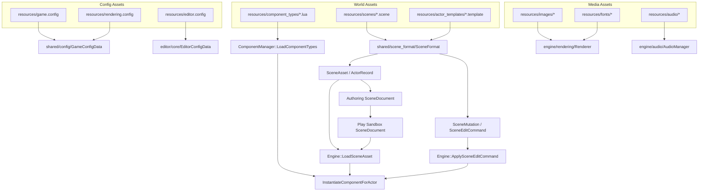

# Asset Pipeline

The engine uses direct runtime loading from `resources/` and shares scene
parsing between runtime and editor.

There is no offline import step.

## Current Asset Flow

## Scene Assets

Scene and template files are parsed through `shared/scene_format`.

That layer is responsible for:

- loading raw `.scene` data into `SceneAsset`
- loading raw `.template` data into `ActorTemplateAsset`
- merging template defaults with scene overrides
- exposing shared mutation-friendly actor/component data structures

## Editor Documents

The editor uses `SceneDocument` as an in-memory mutable scene cache.

At runtime, `EditorSceneSession` manages two document roles:

- authoring document: save target and edit-mode source of truth
- play document: temporary sandbox used only while play mode is active

This separation prevents play-mode edits and simulation changes from leaking
back into the saved scene unless the editor explicitly supports that in the
future.

## Runtime Loading

Runtime scene loading still supports full snapshot loads through
`Engine::LoadSceneAsset(...)`.

This path is used for:

- initial runtime load
- edit-mode preview refresh
- play-mode startup
- play-mode shutdown recovery back to the authoring document

## Mutation Path

Play-mode runtime editing uses a second path in addition to full snapshot load.

The flow is:

- editor panels emit `SceneEditCommand`
- the active scene document applies the command
- `EditorSceneSession` forwards the command to runtime in play mode
- runtime resolves actor targets through stable editor-side actor UIDs
- runtime applies the mutation incrementally when possible

## Notes

- The project still reads assets directly from `resources/`; there is no import
  database or cooked asset cache.
- `SceneDocument` writes back to `.scene` only on save-related actions, not on
  every UI interaction.
- Play-mode sandbox edits are intentionally transient and are not serialized.
