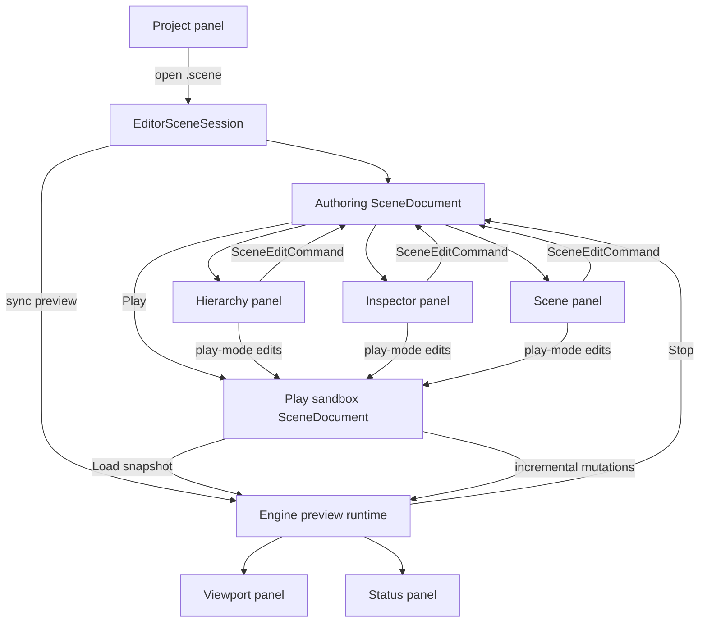

```mermaid
flowchart TD
    Project["Project panel"] -->|open .scene| Session["EditorSceneSession"]
    Session --> Authoring["Authoring SceneDocument"]
    Authoring --> Hierarchy["Hierarchy panel"]
    Authoring --> Inspector["Inspector panel"]
    Authoring --> Scene["Scene panel"]
    Session -->|sync preview| Engine["Engine preview runtime"]
    Engine --> Viewport["Viewport panel"]
    Engine --> Status["Status panel"]

    Hierarchy -->|SceneEditCommand| Authoring
    Inspector -->|SceneEditCommand| Authoring
    Scene -->|SceneEditCommand| Authoring

    Authoring -->|Play| PlayDoc["Play sandbox SceneDocument"]
    PlayDoc -->|Load snapshot| Engine
    Hierarchy -->|play-mode edits| PlayDoc
    Inspector -->|play-mode edits| PlayDoc
    Scene -->|play-mode edits| PlayDoc
    PlayDoc -->|incremental mutations| Engine
    Engine -->|Stop| Authoring
```
