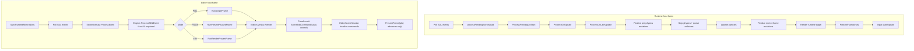

```mermaid
flowchart TD
    subgraph RuntimeHost["Runtime host frame"]
        R0["Poll SDL events"] --> R1["processPendingSceneLoad"]
        R1 --> R2["ProcessPendingOnStart"]
        R2 --> R3["ProcessOnUpdate"]
        R3 --> R4["ProcessOnLateUpdate"]
        R4 --> R5["Finalize pre-physics mutations"]
        R5 --> R6["Step physics + queue collisions"]
        R6 --> R7["Update particles"]
        R7 --> R8["Finalize end-of-frame mutations"]
        R8 --> R9["Render runtime target"]
        R9 --> R10["PresentFrame(true)"]
        R10 --> R11["Input::LateUpdate"]
    end

    subgraph EditorHost["Editor host frame"]
        E0["SyncRuntimeMirrorIfDirty"] --> E1["Poll SDL events"]
        E1 --> E2["EditorOverlay::ProcessEvent"]
        E2 --> E3["Engine::ProcessSDLEvent if not UI-captured"]
        E3 --> E4{"Mode"}
        E4 -->|Play| E5["RunSingleFrame"]
        E4 -->|Pause| E6["RunPresentPausedFrame"]
        E4 -->|Edit| E7["RunRenderFrozenFrame"]
        E5 --> E8["EditorOverlay::Render"]
        E6 --> E8
        E7 --> E8
        E8 --> E9["Panels emit SceneEditCommand / play controls"]
        E9 --> E10["EditorSceneSession handles commands"]
        E10 --> E11["PresentFrame(play advances only)"]
    end
```
