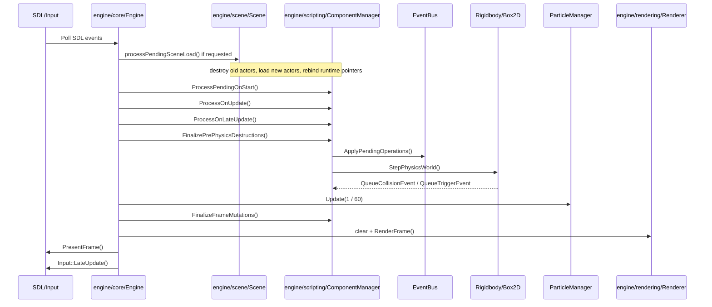
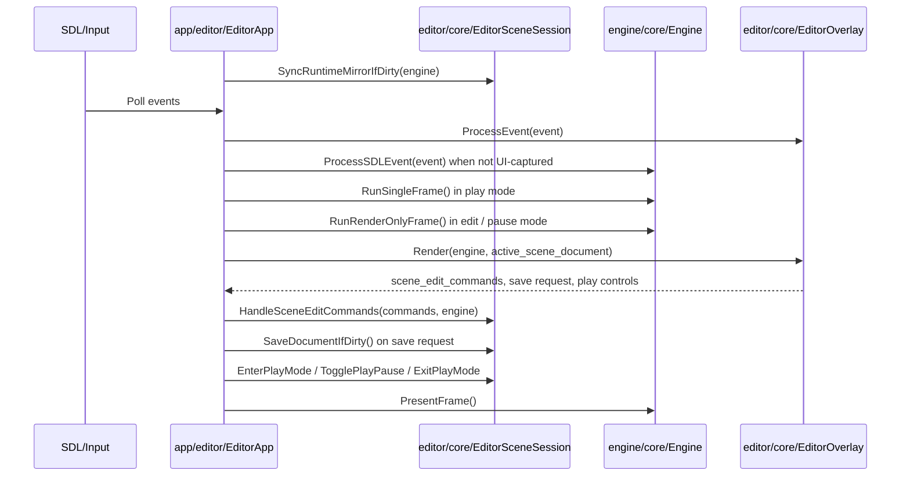

# Frame Pipeline

This document reflects the current runtime/editor split and the mutation-based
play-mode editing flow.

## Runtime Host Frame

Runtime host loop: `Engine::GameLoop()`

## Editor Host Frame

Editor host loop: `EditorApp::Run()`

## Edit Mode Flow

In edit mode, the active scene document is the authoritative authoring
document.

The flow is:

1. GUI panels mutate the authoring `SceneDocument`
2. `EditorSceneSession` marks the runtime mirror dirty
3. On the next frame boundary, runtime is refreshed with
   `Engine::LoadSceneAsset(...)`

This path is simple and deterministic, but it is still a full scene mirror
reload rather than incremental runtime patching.

## Play Mode Flow

In play mode, the active scene document is a temporary sandbox copy.

The flow is:

1. `EditorSceneSession` clones the authoring document into a play document
2. Runtime loads that play snapshot once on play start
3. GUI panels emit `SceneEditCommand`
4. The play document applies the mutations
5. `Engine::ApplySceneEditCommand(...)` incrementally updates the live runtime
6. Stopping play discards the play document and restores runtime from the
   authoring document

## Ordering Rules

1. Scene switch requests are applied at frame start.
2. Lifecycle order remains `OnStart -> OnUpdate -> OnLateUpdate`.
3. Mutation cleanup is split between pre-physics and end-of-frame reconciliation.
4. Physics runs after `OnLateUpdate`.
5. Runtime rendering consumes the reconciled runtime state after simulation and
   mutation cleanup.
6. In edit mode, runtime sync happens only at frame boundaries.
7. In play mode, scene edits are applied to the play sandbox document and live
   runtime in the same frame.
8. Lifecycle ordering for live runtime edits follows current scene container
   order, not just actor ID allocation order.
