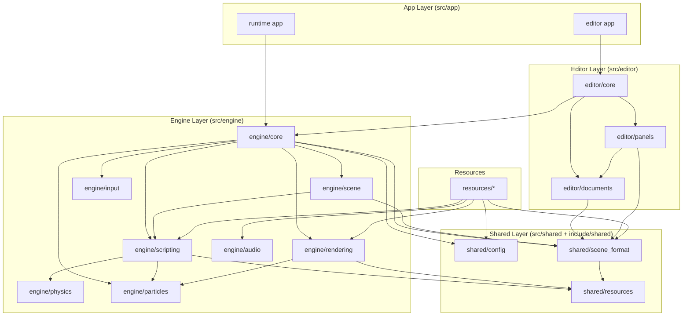

# Module Dependency

This is a high-level architecture graph, not a full include graph.

## Current Layered Graph

## Practical Notes

- The runtime host and editor host are separate executables.
- `shared/scene_format` is the bridge shared by runtime scene loading, editor
  documents, and mutation types.
- `SceneMutation` / `SceneEditCommand` form the shared contract between editor
  UI, document updates, and play-mode runtime sync.
- `engine/scripting` remains the largest integration hub because it owns Lua
  component creation, lifecycle ordering, component queries, and much of the
  runtime mutation reconciliation.
- `shared/resources` is still a light helper layer rather than a full asset
  database.
