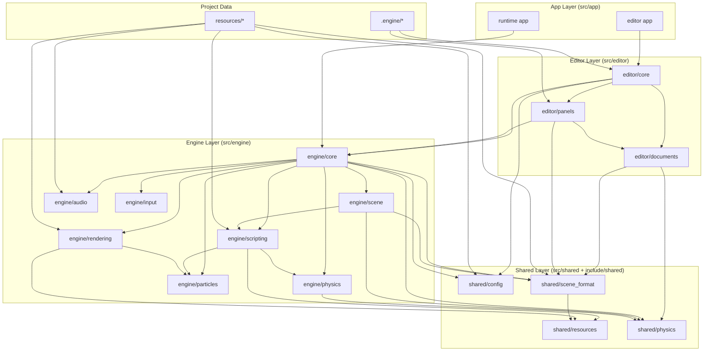

```mermaid
graph TD
    subgraph App["App Layer (src/app)"]
        RuntimeApp["runtime app"]
        EditorApp["editor app"]
    end

    subgraph Editor["Editor Layer (src/editor)"]
        EditorCore["editor/core"]
        EditorDoc["editor/documents"]
        EditorPanels["editor/panels"]
    end

    subgraph Engine["Engine Layer (src/engine)"]
        EngineCore["engine/core"]
        EngineScene["engine/scene"]
        EngineScript["engine/scripting"]
        EngineRender["engine/rendering"]
        EnginePhysics["engine/physics"]
        EngineParticles["engine/particles"]
        EngineAudio["engine/audio"]
        EngineInput["engine/input"]
    end

    subgraph Shared["Shared Layer (src/shared + include/shared)"]
        SharedConfig["shared/config"]
        SharedSceneFormat["shared/scene_format"]
        SharedResource["shared/resources"]
        SharedPhysics["shared/physics"]
    end

    subgraph Assets["Project Data"]
        Resources["resources/*"]
        EnginePrivate[".engine/*"]
    end

    RuntimeApp --> EngineCore
    EditorApp --> EditorCore
    EditorCore --> EditorDoc
    EditorCore --> EditorPanels
    EditorCore --> EngineCore
    EditorCore --> SharedConfig

    EditorDoc --> SharedSceneFormat
    EditorDoc --> SharedPhysics
    EditorPanels --> EditorDoc
    EditorPanels --> SharedSceneFormat
    EditorPanels --> EngineCore

    EngineCore --> EngineScene
    EngineCore --> EngineScript
    EngineCore --> EngineRender
    EngineCore --> EnginePhysics
    EngineCore --> EngineParticles
    EngineCore --> EngineAudio
    EngineCore --> EngineInput
    EngineCore --> SharedConfig
    EngineCore --> SharedPhysics
    EngineCore --> SharedSceneFormat

    EngineScene --> EngineScript
    EngineScene --> SharedSceneFormat
    EngineScene --> SharedPhysics
    EngineScript --> EnginePhysics
    EngineScript --> EngineParticles
    EngineScript --> SharedResource
    EngineRender --> EngineParticles
    EngineRender --> SharedResource
    EnginePhysics --> SharedPhysics

    SharedSceneFormat --> SharedResource

    Resources --> SharedConfig
    Resources --> SharedSceneFormat
    Resources --> EngineScript
    Resources --> EngineRender
    Resources --> EngineAudio
    EnginePrivate --> EditorCore
    EnginePrivate --> EditorPanels
```
