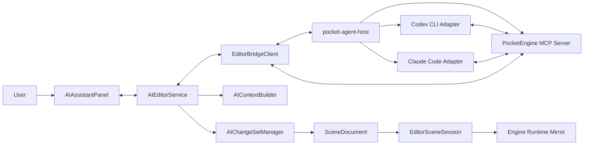
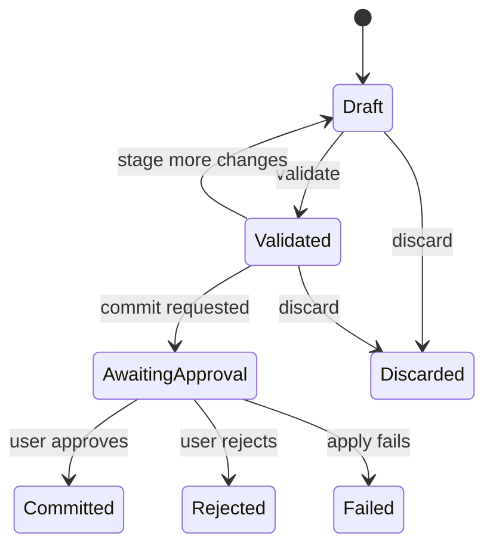

# PocketEngine AI 原生编辑器实现规格

状态：Accepted；Phase 0–1 implemented  
版本：0.1  
创建日期：2026-07-21  
目标版本：AI Integration MVP

## 1. 文档目的

本文定义 PocketEngine AI 原生编辑器的首版实现边界、系统架构、进程协议、MCP 能力、编辑事务、安全模型和验收标准。

首版的目标不是在编辑器里增加一个普通聊天窗口，而是建立一条供应商无关、可观察、可预览、可撤销的 Agent 工作链路：

```text
用户意图
  -> Agent 规划并调用 PocketEngine 工具
  -> 编辑器生成 ChangeSet 预览
  -> 用户确认
  -> SceneDocument 事务提交
  -> Runtime Mirror 更新
  -> Agent 运行和观察游戏
  -> Agent 报告结果或继续修正
```

本文中的 MUST、SHOULD、MAY 分别表示必须、建议和可选要求。

## 2. 目标与非目标

### 2.1 MVP 目标

- 支持用户在编辑器内选择 Codex 或 Claude Code 作为 Agent。
- Agent 以外部子进程运行，复用用户现有安装和登录状态。
- 使用统一的 PocketEngine MCP Server 向不同 Agent 暴露编辑器能力。
- 编辑器是场景、项目和运行时状态的唯一权威数据源。
- AI 场景修改通过现有 `SceneEditCommand` 执行，不直接修改 `.scene` 文件。
- 一次 AI 请求产生一个可预览、可确认、可整体撤销的 `AIChangeSet`。
- 所有 Agent 事件以统一格式流式显示在 `AIAssistantPanel`。
- 提供查询当前场景、Actor、组件类型和项目资源的基础工具。
- 建立后续运行时观察、截图和自动验证所需的扩展边界。

### 2.2 MVP 非目标

- 不在 C++ 进程内直接实现大模型推理。
- 不绑定某个固定模型或供应商。
- 不允许 Agent 绕过编辑器直接写 `.scene` 文件。
- 不在 MVP 中实现完整 Lua 自动生成和文件事务。
- 不在 MVP 中实现多 Agent 协作。
- 不在 MVP 中自动提交 Git 变更、上传项目或访问项目目录外文件。
- 不保证兼容所有历史版本的 Codex/Claude Code CLI。

## 3. 核心设计原则

### 3.1 编辑器拥有状态

`SceneDocument`、项目资源索引和 `Engine` Runtime 是真实状态。MCP Server 只能通过 Editor Bridge 查询或请求修改，不能维护独立的场景副本作为权威状态。

### 3.2 Agent 供应商可替换

Codex、Claude Code 和未来的本地 Agent 必须实现同一 `AgentAdapter` 接口。供应商事件在进入 UI 前必须转换成 PocketEngine 自己的 `AgentEvent`。

### 3.3 工具优先于提示词

编辑能力由带 JSON Schema 的工具定义。Skill 只描述工作流和使用规则，不能代替输入验证、权限检查或事务语义。

### 3.4 所有写操作可追踪

任何 AI 写操作都必须属于一个 `AIChangeSet`，并保留来源 Agent、会话、用户意图、命令列表、验证结果和提交结果。

### 3.5 默认最小权限

外部 Agent 默认只能读取工作区。场景写入通过 MCP 完成。删除、批量修改和未来的文件写入必须经过用户确认。

### 3.6 主线程串行修改

Agent、MCP 和 sidecar 可以异步运行，但对 `SceneDocument`、`EditorSceneSession` 和 `Engine` 的访问必须投递到编辑器主线程执行。

## 4. 系统拓扑



### 4.1 进程边界

首版包含两个进程：

1. `pocket`：现有 C++ 编辑器进程，拥有 UI、项目、文档和 Runtime。
2. `pocket-agent-host`：sidecar，负责 Agent CLI 生命周期、JSON 事件解析和 MCP 服务。

编辑器启动 sidecar，并通过双向 stdin/stdout JSONL 与其通信。sidecar 在 `127.0.0.1` 的随机端口启动 Streamable HTTP MCP endpoint，再把 endpoint 和一次性 token 注入被启动的 Agent 会话。

sidecar MUST：

- 只监听 loopback 地址。
- 使用每次编辑器启动生成的随机 bearer token。
- 不把 token、提示词或会话正文写入项目文件。
- stdout 只输出 Editor Bridge JSONL；诊断日志写 stderr。
- 在父编辑器退出后结束 Agent 子进程并自行退出。

### 4.2 为什么使用 sidecar

- 隔离不同 Agent CLI 的协议变化和崩溃。
- 避免把 HTTP、MCP 和供应商 SDK 依赖引入 `engine_runtime`。
- 允许 sidecar 快速使用成熟的 MCP/JSON/进程管理库。
- 未来可以把 sidecar 打包为独立二进制，而不改变 C++ Editor Bridge 接口。

MVP sidecar 建议使用 TypeScript 实现，Node.js 20 为开发时运行环境。发布策略在 MVP 后单独决定；引擎运行时不得依赖 Node.js。

## 5. 建议目录结构

```text
include/editor/ai/
    AIEditorService.h
    AIEvent.h
    AIChangeSet.h
    AIChangeSetManager.h
    AIContextBuilder.h
    AgentProvider.h

include/editor/bridge/
    EditorBridgeClient.h
    EditorBridgeProtocol.h

src/editor/ai/
    AIEditorService.cpp
    AIChangeSetManager.cpp
    AIContextBuilder.cpp

src/editor/bridge/
    EditorBridgeClient.cpp
    EditorBridgeProtocol.cpp

include/editor/panels/
    AIAssistantPanel.h

src/editor/panels/
    AIAssistantPanel.cpp

tools/pocket-agent-host/
    package.json
    src/index.ts
    src/bridge/
    src/mcp/
    src/adapters/codex.ts
    src/adapters/claude.ts
    src/protocol/

.agents/skills/
    pocketengine-scene-authoring/SKILL.md
```

## 6. Editor Bridge 协议

### 6.1 消息封装

每行是一个完整 JSON 对象：

```json
{
  "protocol_version": 1,
  "id": "msg_42",
  "type": "request",
  "method": "agent.start_session",
  "payload": {},
  "timestamp_ms": 1784635200000
}
```

字段要求：

- `protocol_version`：整数，首版为 `1`。
- `id`：本次请求或事件唯一 ID。
- `type`：`request`、`response` 或 `event`。
- `method`：稳定的方法名。
- `payload`：方法相关对象。
- `timestamp_ms`：发送方本地时间，只用于诊断，不参与排序。

Response 必须包含：

```json
{
  "protocol_version": 1,
  "id": "msg_42",
  "type": "response",
  "method": "agent.start_session",
  "payload": {
    "ok": false,
    "error": {
      "code": "AGENT_NOT_INSTALLED",
      "message": "Codex CLI was not found."
    }
  }
}
```

### 6.2 Editor 发给 sidecar 的方法

| Method | 用途 |
|---|---|
| `host.initialize` | 传入项目根目录、能力和会话 token |
| `host.shutdown` | 有序关闭 sidecar |
| `agent.probe` | 检测可用 Agent、版本和能力 |
| `agent.start_session` | 创建 Agent 会话 |
| `agent.send_message` | 向当前会话发送用户消息 |
| `agent.cancel_turn` | 取消当前 Agent turn |
| `agent.close_session` | 关闭当前会话 |
| `mcp.complete_request` | 返回编辑器执行的 MCP 工具结果 |

### 6.3 sidecar 发给 Editor 的事件

| Method | 用途 |
|---|---|
| `host.ready` | sidecar 初始化完成 |
| `host.error` | sidecar 级错误 |
| `agent.event` | 统一 Agent 事件 |
| `agent.exited` | Agent 子进程退出 |
| `mcp.execute_request` | 请求编辑器执行一个 MCP 工具 |

### 6.4 统一 AgentEvent

```cpp
enum class AgentEventKind {
    SessionStarted,
    AssistantTextDelta,
    AssistantMessage,
    PlanUpdated,
    ToolCallStarted,
    ToolCallCompleted,
    ApprovalRequested,
    UsageUpdated,
    TurnCompleted,
    TurnFailed,
    SessionClosed
};
```

所有事件包含：

```cpp
struct AgentEvent {
    AgentEventKind kind;
    std::string session_id;
    std::string turn_id;
    std::string item_id;
    std::string display_text;
    std::string structured_payload_json;
};
```

UI 不得直接解析 Codex 或 Claude 的原始事件。

## 7. AgentAdapter 规格

### 7.1 通用接口

```ts
interface AgentAdapter {
  readonly provider: "codex" | "claude" | string;

  probe(): Promise<AgentProbeResult>;
  startSession(config: AgentSessionConfig): Promise<AgentSession>;
  sendMessage(sessionId: string, message: string): Promise<void>;
  cancelTurn(sessionId: string): Promise<void>;
  closeSession(sessionId: string): Promise<void>;
}
```

`AgentProbeResult` 至少返回：

- 是否安装。
- CLI 路径。
- 版本字符串。
- 是否支持 JSON 流。
- 是否支持恢复会话。
- 是否支持本地/HTTP MCP。
- 检测错误。

### 7.2 Codex Adapter

MVP 使用 `codex exec --json`。Adapter MUST：

- 使用项目根目录作为 working directory。
- 使用只读 sandbox 启动。
- 解析 JSONL，不依赖终端 ANSI 文本。
- 保存 Codex 返回的 thread/session ID。
- 将 MCP tool call、文本、错误、完成状态转换成 `AgentEvent`。
- 不永久修改用户全局 Codex 配置。

### 7.3 Claude Code Adapter

MVP 使用 `claude -p --input-format stream-json --output-format stream-json`。Adapter MUST：

- 使用项目根目录作为 working directory。
- 禁止直接 Edit、Write 和不受控 Bash 写入。
- 保存 Claude session ID 以支持后续消息。
- 将流式事件转换成 `AgentEvent`。
- 不永久修改用户全局 Claude Code 配置。

### 7.4 退出与取消

- 用户取消时先发送平台正常取消信号。
- 超时后才终止子进程。
- sidecar 必须区分用户取消、CLI 崩溃、认证失败和工具失败。
- Agent 退出不能导致编辑器退出或丢失未提交 ChangeSet。

## 8. PocketEngine MCP 规格

### 8.1 命名规则

- Server name：`pocketengine-editor`
- Tool name 使用 `snake_case`。
- 每个 Tool 必须声明清晰的输入 JSON Schema。
- Tool 输出必须同时包含机器可读数据和简短摘要。
- Tool 错误必须返回稳定错误码，不要求 Agent 解析自然语言。

### 8.2 MVP 查询工具

#### `get_editor_state`

返回当前项目、场景、模式、选中 Actor、文档 dirty 状态及能力版本。

#### `get_current_scene`

输入：

```json
{
  "include_components": true,
  "max_actors": 200
}
```

返回 Actor UID、名称、父 UID、模板名和组件摘要。超出上限时必须返回 `truncated: true`。

#### `inspect_actor`

输入 Actor UID。返回：

- 场景记录。
- effective actor。
- local/world Transform。
- 组件和可检查属性。
- 物理层级状态。

#### `list_component_types`

返回已注册 Lua 和 builtin 组件类型、默认属性及当前加载警告。

#### `search_assets`

按文本、资源类型和最大数量搜索项目内图片、字体、音频、模板、场景和 Lua 组件。

### 8.3 MVP ChangeSet 工具

#### `begin_change_set`

输入标题和用户意图，返回 `change_set_id`。

#### `stage_scene_mutations`

接收与 `SceneMutationPayload` 一一对应的 mutation 数组。MVP 支持：

- `create_actor`
- `delete_actor`
- `set_actor_name`
- `set_actor_parent`
- `add_component`
- `delete_component`
- `rename_component`
- `set_component_type`
- `set_component_property`

工具只暂存，不修改 authoring document。

#### `validate_change_set`

在文档副本上验证：

- UID 唯一且合法。
- Actor/parent/component 存在。
- 不产生层级环。
- 组件 key 唯一。
- 组件类型存在。
- 属性类型可序列化。
- 引用的基础资源可以解析。

#### `preview_change_set`

返回用户可读摘要和结构化 before/after diff。

#### `commit_change_set`

该工具属于强制确认写操作。调用后：

1. 编辑器显示 ChangeSet modal。
2. 用户可以批准或拒绝。
3. 批准后，所有 mutation 作为一个事务应用。
4. 产生一个 Undo entry。
5. 增量同步 Runtime Mirror；失败时标记 full mirror dirty。
6. Tool call 返回最终结果。

#### `discard_change_set`

丢弃尚未提交的 ChangeSet。

### 8.4 ChangeSet 状态机



```cpp
struct AIChangeSet {
    std::string id;
    std::string title;
    std::string user_intent;
    std::string provider;
    std::string agent_session_id;
    AIChangeSetState state;
    std::vector<SceneFormat::SceneEditCommand> commands;
    std::vector<AIValidationMessage> validation_messages;
};
```

MVP 只允许同一时间存在一个 AwaitingApproval 的 ChangeSet。

## 9. AI 游戏感知模型

游戏感知分为语义、时间和视觉三层。MVP 实现语义层；后续阶段实现时间和视觉层。

### 9.1 语义层

通过查询工具提供：

- 项目和当前场景。
- Actor 层级。
- effective components 和属性。
- 组件 schema。
- 资源索引。
- 编辑器状态与选择。

默认返回摘要，详细数据由 Agent 按 UID 查询，避免把整个项目重复放进上下文。

### 9.2 时间层

Phase 2 新增：

- `enter_play_mode`
- `pause_play_mode`
- `stop_play_mode`
- `step_frames`
- `get_runtime_snapshot`
- `inspect_runtime_actor`
- `get_runtime_events`
- `get_recent_diagnostics`

`step_frames` 必须有最大步数限制，默认 1，单次最多 600。它必须在编辑器帧循环中执行，不得从 MCP 线程直接调用 `Engine::RunSingleFrame`。

Runtime snapshot 应支持：

- `actor_uids`
- `component_types`
- `changed_since_frame`
- `include_children`
- `max_events`

### 9.3 视觉层

Phase 2 新增：

- `capture_viewport`
- `capture_scene_view`

返回 PNG 图像和 frame、尺寸、相机信息。截图必须复用现有 Runtime/Scene preview render target，不从操作系统桌面截图。

### 9.4 诊断层

Phase 2 增加统一 `DiagnosticManager`：

```cpp
struct Diagnostic {
    DiagnosticSeverity severity;
    std::string subsystem;
    std::string code;
    std::string message;
    std::filesystem::path file;
    int line = 0;
    Actor::UID actor_uid = Actor::kInvalidUID;
    std::string component_key;
    std::uint64_t frame = 0;
};
```

Lua、资源解析、场景验证和 Runtime 错误逐步从仅写 `std::cout` 迁移到结构化诊断；控制台输出可以保留。

## 10. Skill 规格

首个 Skill 名称为 `pocketengine-scene-authoring`。

Skill MUST 指导 Agent：

1. 先读取 editor state 和 scene 摘要。
2. 修改前检查 Actor、组件 schema 和资源。
3. 一个用户请求只创建一个主 ChangeSet。
4. 不直接编辑 `.scene` 文件。
5. 先 validate 和 preview，再请求 commit。
6. 不猜测 UID、组件 key 或属性类型。
7. 用户拒绝提交后不得重复提交相同 ChangeSet。
8. 工具失败时报告稳定错误码和下一步，而不是反复重试。

Skill 内容维护一份规范源。Codex/Claude 的发现位置或打包元数据由 sidecar 安装器适配，不复制两套不同工作流正文。

## 11. UI 规格

`AIAssistantPanel` 至少包含：

- Provider 选择器。
- Agent 安装、认证和 MCP 连接状态。
- 会话消息列表。
- 流式回复。
- 当前工具调用和耗时。
- Stop 按钮。
- 当前 ChangeSet 摘要。
- Preview、Approve、Reject 按钮。
- 错误详情及可复制诊断。

UI 状态：

```text
Disconnected
Ready
StartingSession
Idle
RunningTurn
AwaitingApproval
Cancelling
Error
```

关闭面板不得结束会话；关闭项目、切换项目或退出编辑器前必须处理未提交 ChangeSet，并关闭 Agent 会话。

## 12. 安全、权限与隐私

### 12.1 权限分级

| 等级 | 示例 | 默认行为 |
|---|---|---|
| Read | 查询场景、Actor、资源 | 自动允许 |
| Reversible write | 创建 Actor、修改属性 | ChangeSet 确认 |
| Destructive write | 删除、批量覆盖 | 强制确认并高亮 |
| External | 网络、项目外文件、Git push | MVP 禁止 |

### 12.2 数据边界

- UI 必须显示当前 Agent provider。
- 首次启动 Agent 前必须说明项目内容可能发送给对应云服务。
- PocketEngine 不记录供应商认证 token。
- 默认 devlog/日志不得保存完整 prompt、模型响应或源码正文。
- session token 仅存在内存和子进程环境中。
- MCP 工具必须拒绝访问当前 project root 之外的资源。

### 12.3 Prompt injection 防护

- 项目资源和 Lua 文件视为数据，不视为系统指令。
- Tool description 和 Skill 明确禁止执行资源文件内的指令。
- Agent 无直接 shell 写权限。
- 所有写操作经过 typed mutation 和编辑器验证。

## 13. 并发与故障处理

- Editor Bridge reader 在后台线程读取 JSONL。
- 解析后的事件进入线程安全队列。
- Editor 主循环每帧消费有限数量事件，避免 UI 卡顿。
- MCP 请求必须有超时；超时不能留下半提交状态。
- ChangeSet 提交在主线程完成，并采用全有或全无语义。
- sidecar 崩溃后编辑器保留所有未提交 ChangeSet，并允许重新启动。
- MCP 断开时 Agent turn 必须收到明确工具错误。
- 项目切换期间停止接受新的工具请求。

## 14. 测试策略

### 14.1 C++ 单元测试

- Bridge JSON 编解码。
- AgentEvent 映射后的稳定结构。
- ChangeSet 状态机。
- mutation validation。
- ChangeSet apply/rollback。
- AI 操作作为单个 Undo entry。

### 14.2 sidecar 测试

- Codex JSONL fixture 解析。
- Claude stream-json fixture 解析。
- Agent probe。
- 子进程取消和异常退出。
- MCP schema 和错误码。
- Editor Bridge 超时和断线。

### 14.3 集成测试

测试使用 Fake Agent，不依赖真实云服务：

1. Fake Agent 调用 `get_current_scene`。
2. 创建 ChangeSet。
3. staged mutations 创建一个 Actor 和 Transform。
4. validate 成功。
5. 用户批准。
6. SceneDocument 和 Runtime Mirror 均出现新 Actor。
7. Undo 后两者恢复。

### 14.4 手动验收场景

用户输入：

> 在当前场景创建三个名为 Box 的 Actor，水平排列，间距为 2，并给它们添加 Transform 和 SpriteRenderer，图片使用 box2。

验收要求：

- Codex 和 Claude Code 都能完成同一请求。
- AI 不直接修改 `.scene` 文件。
- 提交前可以看到三个 Actor 的预览摘要。
- 一次批准完成全部修改。
- Hierarchy、Inspector 和 Runtime Preview 同步更新。
- 一次 Undo 撤销全部修改。

## 15. 实施阶段

### Phase 0：协议与测试骨架

- 定义 Bridge protocol v1。
- 定义 `AgentEvent`、`AIChangeSet` 和错误码。
- 建立 sidecar TypeScript 工程。
- 实现 Fake Agent adapter。
- 建立 C++/sidecar fixture 测试。

退出条件：编辑器能启动 sidecar、显示 Fake Agent 流式消息并安全关闭。

### Phase 1：只读 AI 会话

- `AIAssistantPanel`。
- Codex Adapter。
- Claude Adapter。
- MCP Server。
- `get_editor_state`、`get_current_scene`、`inspect_actor`、`list_component_types`、`search_assets`。

退出条件：两个真实 Agent 均能解释当前场景，且没有写权限。

### Phase 2：ChangeSet 场景编辑

- `AIChangeSetManager`。
- stage、validate、preview、commit、discard 工具。
- 确认 modal。
- SceneDocument 副本验证。
- 事务提交和统一 Undo。
- Runtime Mirror 同步。

退出条件：完成第 14.4 节的跨 Agent 验收场景。

### Phase 3：游戏观察与验证

- Runtime 单步推进。
- Runtime snapshot。
- 结构化 diagnostics。
- Viewport/SceneView 截图。
- `pocketengine-runtime-debugging` Skill。

退出条件：Agent 能创建对象、进入 Play、推进帧、检查错误和截图，再给出验证结论。

### Phase 4：Lua 和项目文件事务

- 文件 patch ChangeSet。
- Lua 语法/加载验证。
- 组件脚本创建和修改。
- 文件级 preview/rollback/Undo。
- `pocketengine-lua-component` Skill。

退出条件：Agent 能创建 Lua 组件、添加到 Actor、运行验证，并整体撤销场景及文件修改。

## 16. MVP Definition of Done

- macOS、Windows、Linux 上至少能启动 Fake Agent sidecar。
- Codex 和 Claude Code 均可探测、启动、取消和关闭。
- Agent 原始协议不会泄漏到 UI 或 C++ Editor 核心。
- MCP 查询工具均有 schema、稳定错误码和单元测试。
- AI 场景写入只能通过 ChangeSet。
- ChangeSet 支持验证、预览、确认、提交、拒绝和整体 Undo。
- 项目切换、Agent 崩溃和编辑器退出不会自动提交未确认修改。
- 默认项目示例可以完成跨 Agent 手动验收。
- 用户文档说明安装要求、数据边界和权限模型。

## 17. 首版错误码

```text
HOST_NOT_READY
HOST_PROTOCOL_MISMATCH
AGENT_NOT_INSTALLED
AGENT_AUTH_REQUIRED
AGENT_UNSUPPORTED_VERSION
AGENT_PROCESS_FAILED
AGENT_TURN_CANCELLED
MCP_UNAUTHORIZED
MCP_EDITOR_DISCONNECTED
MCP_TOOL_TIMEOUT
PROJECT_SWITCH_IN_PROGRESS
SCENE_NOT_LOADED
ACTOR_NOT_FOUND
COMPONENT_NOT_FOUND
COMPONENT_TYPE_NOT_FOUND
ASSET_NOT_FOUND
CHANGE_SET_NOT_FOUND
CHANGE_SET_INVALID_STATE
CHANGE_SET_VALIDATION_FAILED
CHANGE_SET_REJECTED
CHANGE_SET_APPLY_FAILED
```

## 18. 待决策事项

以下事项不阻塞 Phase 0：

- sidecar 发布时内嵌 Node runtime、编译为单文件，还是要求开发环境安装 Node。
- MCP Streamable HTTP 依赖库和版本锁定策略。
- 正式 Undo/Redo 系统是 AI 专用实现，还是先升级为全编辑器统一命令栈。
- Agent 会话历史是否持久化，以及持久化位置。
- Phase 4 文件事务如何与外部编辑器同时修改文件协调。
- 截图传给模型前的默认分辨率、压缩和隐私提示。
- 是否提供直接 API Provider，及其 Keychain/Credential Manager 接入方式。
