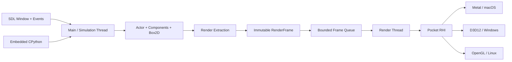

# Pocket3D 长期架构路线图

状态：Proposed
版本：0.2
创建日期：2026-07-27
修订日期：2026-08-16
目标分支：`pocket3d`

当前实施阶段：[Phase 1：Cross-platform OpenGL 3D Rendering](pocket3d-phase-1-cross-platform-opengl.md)

## 0. 文档边界

本文只描述 Pocket3D 在首个 3D 垂直切片完成后的长期架构改革，包括 Python Runtime、统一 RHI、多平台图形后端、独立渲染线程和后续优化。

当前正在实施的 Phase 1 不依赖这些改革。Phase 1 在保留 Lua、Box2D、主线程执行和现有 SDL2 窗口/输入体系的前提下，先用 OpenGL 4.1 Core 在 Windows、macOS、Linux 建立相同的 3D 行为基线。本文的 Python、RHI、渲染线程与原生 Direct3D 12/Metal 里程碑只有在 Phase 1 验收完成后才开始。

## 1. 文档目的

本文定义 PocketEngine 在 `pocket3d` 分支完成首个 3D 垂直切片后的核心架构改革计划。改革包含三条主线：

1. 使用 Python 替代 Lua 作为游戏脚本语言；
2. 将渲染执行从主线程迁移到独立渲染线程，并为后续原生 Job System 建立边界；
3. 用统一 RHI 支撑 macOS Metal、Windows Direct3D 12 和 Linux OpenGL 后端。

这三条主线不能作为三个互不相关的重写项目推进。新的脚本系统负责在主线程更新游戏状态，主线程把当前世界提取为不可变的 `RenderFrame`，渲染线程只通过 RHI 消费该帧。脚本对象、Actor 指针、Python 对象和 Box2D 对象不得跨越渲染线程边界。

本文中的 MUST、SHOULD、MAY 分别表示必须、建议和可选要求。

## 2. 总体目标

### 2.1 必须实现

- 游戏项目使用 Python 编写组件和生命周期逻辑，不再依赖 Lua/LuaBridge。
- 场景、Actor、组件属性和生命周期语义在迁移前后保持可验证的一致性。
- 渲染 API 不向 Engine、组件、脚本和编辑器暴露平台原生纹理或设备指针。
- macOS 使用 Metal，Windows 使用 Direct3D 12，Linux 使用 OpenGL。
- SDL2 首阶段继续负责窗口、事件和输入；音频可继续使用现有 SDL2_mixer。
- 主线程负责窗口事件、Python、游戏逻辑、场景变更和物理。
- 独立渲染线程拥有图形上下文、GPU 资源和 Present。
- Runtime View、Scene View、编辑器 UI 都通过明确的 Render Pass 合成。
- 每个阶段都必须保持仓库可编译、可测试，并提供明确的退出条件。

### 2.2 首轮改革不包含

- 不同时实现完整 3D 功能、PBR、阴影、骨骼动画或 GPU Driven Rendering。
- 不在首版并行执行 Python 组件生命周期。
- 不把 SDL2 从输入、窗口和音频层完全移除。
- 不要求旧 Lua 项目在最终版本中继续运行。
- 不在首版设计通用任务图或无锁 Job System。
- 不在首版支持运行时热切换图形后端。

Pocket3D 的首个 3D 功能由独立的 Phase 1 先行交付。本文描述的改革随后完成基础设施、现有 2D 示例的行为/画面等价迁移和多平台扩展；Python Runtime、统一 RHI 和渲染线程不再是第一个 3D 画面的前置条件。

## 3. 改革前基线与主要耦合

本节记录 Phase 1 启动前的 2D 基线，用来解释长期改革需要解除的耦合。Phase 1 新增的 3D 数据、render extraction 和 OpenGL 实现应在改革开始时一并纳入基线审计。

### 3.1 脚本系统

当前 `ComponentManager` 同时承担：

- Lua VM 初始化和关闭；
- C++ API 注入；
- 组件类型脚本加载；
- 组件实例存储和查询；
- 生命周期排序与调用；
- Actor 变更、物理事件和 EventBus 桥接。

关键实现位于：

- `include/engine/scripting/ComponentManager.h`
- `src/engine/scripting/manager/Internal.h`
- `src/engine/scripting/manager/Runtime.cpp`
- `src/engine/scripting/manager/Binding.cpp`
- `src/engine/scripting/manager/Lifecycle.cpp`
- `src/engine/scripting/luaapi/`

`luabridge::LuaRef` 已进入 `ComponentManager` 的公开接口，Lua 对象也被用来包装 `Transform`、`Rigidbody`、`SpriteRenderer` 和 `ParticleSystem` 等原生组件。迁移前必须先把“组件生命周期管理”与“具体脚本 VM”分离。

此外，`SpriteRenderer` 的 render extraction 和 Engine 的编辑器热更新路径也会直接查询、转换 `LuaRef`。因此 Python 与 RHI 有一个共同前置任务：建立语言无关的原生组件 registry/query。Render Extractor 必须读取原生组件快照，不能经由 Lua 或 Python 对象查询 Transform、Rigidbody 和 SpriteRenderer。

### 3.2 渲染系统

当前渲染已有逐帧请求队列，但 `SDL_Renderer*` 和 `SDL_Texture*` 仍进入：

- `Engine`
- `Renderer`
- `ParticleManager`
- Runtime/Scene 离屏 RenderTarget
- Editor Project/Viewport/SceneView 面板
- Dear ImGui SDL Renderer 后端

关键实现位于：

- `include/engine/rendering/Renderer.h`
- `src/engine/rendering/Renderer.cpp`
- `include/engine/core/Engine.h`
- `src/engine/core/Engine.cpp`
- `src/engine/particles/ParticleManager.cpp`
- `src/editor/core/EditorOverlay.cpp`

### 3.3 帧与线程

当前事件、脚本生命周期、物理、粒子、绘制请求生成、SDL GPU 调用、ImGui 和 Present 基本都在主线程顺序执行。编辑器每帧还需要生成 Runtime View 和 Scene View 两个离屏结果，再合成 ImGui。

这意味着不能先直接创建渲染线程；必须先把 GPU 工作表示为不引用运行时对象的不可变帧数据。

## 4. 目标架构



### 4.1 所有权规则

| 数据/能力 | 所有线程 | 允许跨线程的形式 |
|---|---|---|
| SDL 事件、输入状态 | 主线程 | 帧快照 |
| Python VM 和 Python 对象 | 主线程 | 禁止直接跨线程 |
| Actor、组件、Scene、Box2D | 主线程 | ID、值拷贝、不可变快照 |
| `RenderFrame` | 提交前主线程；提交后渲染线程 | 所有权转移 |
| GPU Device、Context、Swapchain | 渲染线程 | 句柄和消息 |
| 纹理 CPU 解码结果 | Worker/主线程 | 所有权转移到上传队列 |
| GPU Resource | 渲染线程 | generation handle |

### 4.2 帧数据流

```text
Poll events
  -> Python OnStart / OnUpdate / OnLateUpdate
  -> finalize mutations
  -> Box2D step and collision dispatch
  -> particle simulation
  -> render extraction
  -> submit immutable RenderFrame
  -> Input::LateUpdate

Render thread:
wait for RenderFrame
  -> process resource uploads/deletes
  -> execute Runtime View pass
  -> execute Scene View pass
  -> execute Editor UI pass
  -> present
```

## 5. 工作流 A：Python 脚本运行时

### 5.1 技术决策

- 使用嵌入式 CPython，不依赖用户机器上的系统 Python。
- CPython 版本 MUST 在仓库构建配置中固定；具体版本由早期跨平台打包 Spike 决定。
- C++/Python 绑定层 SHOULD 采用成熟的薄封装库；若其发布和 ABI 成本不可接受，则退回 CPython C API。
- 首版使用一个解释器和一个主线程 GIL 所有者。
- 游戏脚本只能通过 PocketEngine 模块访问引擎，不暴露内部裸指针。
- 项目脚本目录由 `component_types/` 保持或迁移为 `scripts/components/`，最终路径必须通过项目格式版本明确。

### 5.2 先拆边界，再替换 VM

新增与语言无关的运行时接口：

```cpp
class IScriptRuntime {
public:
    virtual ~IScriptRuntime() = default;
    virtual bool Initialize(const ScriptRuntimeConfig&) = 0;
    virtual void Shutdown() = 0;
    virtual ScriptTypeHandle LoadComponentType(const ScriptAsset&) = 0;
    virtual ScriptInstanceHandle CreateComponent(
        ScriptTypeHandle, ActorHandle, const PropertyMap&) = 0;
    virtual ScriptCallResult Invoke(
        ScriptInstanceHandle, LifecycleMethod, const ScriptArguments&) = 0;
    virtual bool GetProperty(
        ScriptInstanceHandle, PropertyId, PropertyValue&) = 0;
    virtual bool SetProperty(
        ScriptInstanceHandle, PropertyId, const PropertyValue&) = 0;
};
```

`ScriptInstanceHandle` MUST 是 generation handle，公共接口不得返回 `LuaRef`、`PyObject*` 或语言专属对象。

当前 `ComponentManager` 应拆分为：

- `ComponentRegistry`：组件类型和元数据；
- `ComponentWorld`：Actor 到组件实例的索引；
- `LifecycleScheduler`：稳定排序、OnStart、Update、LateUpdate、Destroy；
- `ScriptRuntime`：Python VM、模块加载和调用；
- `EnginePythonModule`：Actor、Application、Input、Physics、Rendering、Audio API；
- `EventBus`：语言无关的订阅身份和消息值，Python 只提供回调适配器。

### 5.3 Python 组件约定

建议首版组件格式：

```python
from pocket import Component, exposed

class KeyboardControls(Component):
    speed: float = exposed(3.0)

    def OnUpdate(self) -> None:
        if pocket.Input.get_key("right"):
            self.actor.transform.x += self.speed
```

要求：

- 一个脚本文件 MAY 定义多个组件，但组件类型名在项目内必须唯一。
- 首版保持现有 `OnStart`、`OnUpdate`、`OnLateUpdate`、`OnDestroy`、碰撞和 Trigger 生命周期命名，避免同时改变语言和行为语义。
- 可编辑属性必须通过类型注解和显式 `exposed(...)` 声明。
- Inspector 和 AI 查询组件元数据时 SHOULD 静态解析声明或读取构建期 manifest，不应为了读取默认值而在编辑器中执行项目脚本。
- list/dict 等可变默认值必须为每个实例独立创建，禁止共享 Python class mutable default。
- 场景继续保存语言无关的 `ComponentPropertyValue`。
- Python 异常必须包含脚本路径、组件类型、Actor、生命周期方法和 traceback。
- `on_start` 中创建的组件延迟到下一帧启动等现有生命周期规则必须保留。
- 组件迭代顺序继续按 Actor 顺序和 component key 稳定排序。

### 5.4 迁移策略

迁移期可暂时同时编译 Lua 与 Python Runtime，但同一个项目/场景 MUST 只选择一种脚本语言，禁止一个 Actor 混用两套 VM。双运行时只用于对照测试，不能成为长期兼容层。

迁移顺序：

1. 建立语言无关的属性、句柄、调用结果和错误类型。
2. 用 `LuaScriptRuntime` 适配现有行为，证明新接口没有改变语义。
3. 实现 `PythonScriptRuntime` 和最小 `pocket` 模块。
4. 迁移 Default 项目的组件脚本。
5. 建立 Lua/Python 行为对照测试。
6. 实现帧安全点热重载：重建实例、迁移已声明的可序列化字段、清理旧 EventBus 订阅和 bound method。
7. 默认切换到 Python。
8. 删除 LuaBridge、Lua API 注册和 `.lua` 示例。

项目脚本按 trusted code 处理。嵌入式 CPython不是安全沙箱；如果未来需要执行不可信或 AI 生成但未获确认的脚本，必须使用独立受限进程，不能依靠删除 Python builtins 实现隔离。

## 6. 工作流 B：跨平台 RHI 与渲染后端

### 6.1 RHI 原则

RHI MUST 使用 Metal/D3D12 风格的显式资源和命令语义，OpenGL 后端负责适配这些语义。不得按照 OpenGL 全局状态机设计公共接口。

基础对象：

- `RenderDevice`
- `Swapchain`
- `CommandQueue`
- `CommandBuffer`
- `BufferHandle`
- `TextureHandle`
- `SamplerHandle`
- `ShaderHandle`
- `PipelineHandle`
- `RenderTargetHandle`
- `Fence`

资源句柄 MUST 包含 slot 和 generation。销毁为延迟操作，只有在所有引用该资源的在途帧完成后才释放底层 GPU 对象。

### 6.2 RenderFrame 与 RenderPass

```cpp
struct RenderFrame {
    std::uint64_t frame_index;
    std::vector<ResourceUpload> uploads;
    std::vector<RenderPass> passes;
    EditorDrawPacket editor_ui;
};
```

首版 Pass：

1. Runtime View；
2. Scene View；
3. Editor UI / Window；
4. Present。

Draw command MUST 只包含值和 RHI handle，不包含：

- `Actor*`
- `PyObject*`
- `SDL_Texture*`
- `SDL_Renderer*`
- 平台原生 GPU 指针

### 6.3 后端

#### macOS / Metal

- SDL 创建 Metal-compatible window；
- Objective-C++ 实现放入独立 `.mm` 文件；
- 渲染线程拥有 command queue、drawable 和资源；
- 渲染线程每轮命令编码应建立合适的 autorelease pool；
- 支持 Xcode GPU capture 和 debug label。

#### Windows / Direct3D 12

- 实现 DXGI swapchain、descriptor heap、upload heap、resource barrier 和 fence；
- 每个 frame-in-flight 拥有独立 command allocator 和瞬时资源区；
- 必须测试 resize、最小化恢复和 device removed 错误路径。

#### Linux / OpenGL

- 使用 Core Profile；
- 具体最低版本由 Linux 驱动矩阵 Spike 决定；
- OpenGL 后端内部维护显式状态缓存，模拟 RHI 的资源状态；
- 图形上下文只允许渲染线程 current。

窗口创建 flags 必须在创建 SDL Window 之前由 `BackendFactory` 决定：Metal、D3D12 和 OpenGL 不能继续共用当前固定的窗口创建路径。SDL Window 保留为平台壳层，但 swapchain/context/view 的创建归各后端负责。

### 6.4 Shader 与 Pipeline

三个后端不应长期手写维护三份 Shader。早期 Spike 必须验证单一 Shader 源工作流。建议以 HLSL 为源：

```text
HLSL
  -> DXIL for D3D12
  -> SPIR-V + translation/reflection for Metal
  -> SPIR-V/GLSL path for OpenGL
```

工具链选择必须满足：

- 离线编译；
- 可复现构建；
- 统一 reflection；
- 自动校验 constant buffer、texture、sampler 和 vertex layout；
- 编译错误可映射回原始 Shader 文件。

如果 Spike 证明某个平台的发布或许可成本不合适，允许调整中间表示，但 RHI binding layout 不得因此分叉。

### 6.5 2D 等价迁移

首版必须覆盖：

- Sprite 和 spritesheet UV；
- pivot、rotation、negative scale；
- color/alpha modulation；
- sorting order 和稳定 submission order；
- UI image、pixel/debug primitive；
- text；
- particle batch；
- Runtime/Scene RenderTarget；
- ImGui。

Sprite batch key 建议为：

```text
pass -> sorting order -> pipeline -> blend -> texture
```

同一排序层内必须保留可定义的稳定顺序。粒子在功能等价后使用 instancing。

当前 Present 同时承担交换缓冲、帧节流、录屏和 `FrameClock` 推进。迁移时必须拆成独立的 `FrameScheduler`、`CaptureService` 和后端 Present，不能只把 `SDL_RenderPresent` 替换为平台 swap。

Project 面板当前拥有独立的 SDL 纹理缓存。迁移时应并入 `EditorTextureService` / `ImGuiTextureRegistry`，避免编辑器资源绕开统一 GPU 生命周期。

## 7. 工作流 C：多线程

### 7.1 首版线程拓扑

```text
Main thread:
SDL events + Python + Actor + Box2D + scene mutations + render extraction

Render thread:
RHI + GPU resources + command execution + present

Optional worker threads:
file IO + image decode + non-Python asset preprocessing
```

### 7.2 帧队列

- 使用 2 或 3 个预分配 frame slot。
- 队列有界；队列满时主线程等待，禁止无限累积输入延迟。
- 首版使用 `mutex + condition_variable`，不以 lock-free 为目标。
- 提交后主线程不得修改 `RenderFrame`。
- 渲染线程完成帧后归还 slot。
- Shutdown、窗口 resize、场景切换和资源重载必须有明确的同步点。

### 7.3 编辑器 UI

主线程执行 ImGui frame building。`ImGui::Render()` 后必须把绘制数据复制或转换为引擎拥有的 `EditorDrawPacket`，不能让渲染线程读取下一帧会失效的 ImGui 临时内存。

### 7.4 后续 Job System

渲染线程稳定后，MAY 增加原生 Job System，用于：

- 资源扫描和解码；
- 可并行的 transform/render extraction；
- 粒子更新；
- 编辑器后台索引。

Python 生命周期和 Box2D 首版保持主线程串行。任何并行化都必须先声明读写集合，不能把 GIL 释放视为运行时状态可安全并行的证明。

## 8. 里程碑与依赖顺序

### M0：基线、ADR 与可观测性

交付：

- 保存 Default 项目的画面和行为基线；
- CPU frame、script、physics、render extraction、GPU、Present 指标；
- 记录 draw call、sprite、particle、resource upload 数；
- 完成 Python embedding、跨平台 Shader toolchain、Phase 1 OpenGL 实现审计和 Direct3D 12/Metal window/context Spike；
- 为关键技术决策建立 ADR。

退出条件：

- 三个平台至少能在 CI 或指定验证机上构建最小窗口程序；
- 基线场景有自动化或可重复的验收步骤；
- 固定 CPython、绑定层和 Shader 工具链方案。

### M1：语言无关组件 Runtime

交付：

- 拆分 `ComponentManager` 职责；
- 引入 `IScriptRuntime` 和 opaque handles；
- 建立 native component registry/query，使 Transform、Rigidbody、SpriteRenderer 和 ParticleSystem 不再经由脚本对象访问；
- 现有 Lua 通过适配器运行；
- 公共头文件不再暴露 `LuaRef`。

退出条件：

- Default Lua 项目行为不变；
- 生命周期、场景切换、增删组件、碰撞和 EventBus 测试通过。

### M2：RHI Contract 与 Null Backend

交付：

- RHI handles、descriptors、command buffer、render pass；
- `RenderFrame` 和 render extraction；
- Null Backend 命令验证和资源生命周期测试；
- Engine/Editor 公共接口不再暴露 `SDL_Renderer*`、`SDL_Texture*`。

退出条件：

- Null Backend 可以验证 Default 2D 场景和 Phase 1 Pocket3D 验收场景生成的 pass 与 draw command；
- 资源 use-after-free、错误 generation 和非法 pass 顺序能被测试发现。

### M3：Python Runtime MVP

交付：

- 嵌入式 CPython；
- `pocket` 模块最小 API；
- Python 组件发现、实例化、属性和生命周期；
- traceback 和编辑器组件元数据。

退出条件：

- Python 实现的最小场景支持 OnStart、Update、Actor 查询和 SpriteRenderer；
- Python 异常不导致引擎退出；
- 热重载策略已明确并覆盖失败回滚。

### M4：首个 RHI 真实后端

优先把 Phase 1 已验证的 OpenGL 实现收敛到 RHI contract 之下。允许重用已经验证的资源创建、draw、离屏目标和编辑器集成行为，但不得按照 OpenGL 全局状态机塑造公共 RHI，也不得把 Phase 1 的平台类型直接提升为公共接口。这个首个后端用于验证 RHI 数据边界；显式资源与命令语义仍以未来 Metal/Direct3D 12 的共同需求为准。

交付：

- Window、swapchain、clear、triangle；
- texture、sampler、pipeline、buffer；
- sprite batch 和 offscreen RenderTarget；
- Runtime View、Scene View 和 ImGui。

退出条件：

- Default 2D 场景和 Phase 1 Pocket3D 验收场景画面与各自基线等价；
- resize、HiDPI、暂停/编辑/播放模式正确；
- 无持续增长的 GPU 资源。

### M5：Default 项目迁移到 Python

交付：

- 全部示例 `.lua` 转为 `.py`；
- Python API 文档；
- 项目格式或脚本语言版本标记；
- 可选的一次性 Lua-to-Python 迁移辅助工具。

退出条件：

- 示例游戏行为对照测试通过；
- 新项目只生成 Python 模板；
- 编辑器 Inspector 正确显示 Python 暴露属性。

### M6：原生平台后端

交付顺序建议：

1. Windows Direct3D 12；
2. macOS Metal；
3. Linux 继续使用已收敛到 RHI 的 OpenGL。

OpenGL 已在 M4 进入 RHI。Direct3D 12 与 Metal 只有在相同 conformance suite 和 Shader binding contract 固定后才能并行开发；Windows/macOS 原生后端通过验收前，Phase 1 OpenGL 路径仍是行为对照基线。

退出条件：

- 三个平台通过相同 RHI conformance suite；
- Default 场景的关键截图和行为一致；
- Shader reflection 和 binding 在三平台一致；
- 平台实现无上层 `#ifdef` 泄漏。

### M7：独立渲染线程

交付：

- bounded frame queue；
- 2–3 frames in flight；
- GPU upload/delete queue；
- ImGui draw packet；
- resize、shutdown、scene reload 同步协议。

退出条件：

- ThreadSanitizer 可覆盖的路径无数据竞争；
- 主线程不执行 GPU API；
- 渲染线程不访问 Python、Actor 或 Box2D；
- 暂停、单帧、编辑器预览和退出无死锁。
- GPU 压力下帧队列始终保持上限，端到端输入延迟不会随积压无限增长。

### M8：优化与清理

交付：

- sprite batching；
- particle instancing；
- texture/glyph atlas；
- 异步资源 IO 和解码；
- 删除 Lua/LuaBridge 和 SDL Renderer 后端；
- 更新架构图、开发文档和打包脚本。

退出条件：

- 性能不低于 M0 基线，并有可量化提升目标；
- 三个平台发布包不依赖系统 Python；
- 仓库不存在运行时 Lua 路径和 SDL Renderer 图形调用。

## 9. 并行开发策略

只有在公共 contract 固定后才并行实现后端。

可并行工作：

- Python Runtime 与 RHI Contract；
- 平台后端与 Python 示例迁移；
- 资源解码队列与后端 conformance tests；
- 文档、示例和 CI 平台矩阵。

不可无序并行：

- 在 `IScriptRuntime` 确定前同时大改所有 Lua 调用点；
- 在 `RenderFrame` 确定前直接把现有 SDL 调用分别翻译成三套后端；
- 在单线程 RHI 稳定前引入渲染线程；
- 在资源句柄和延迟销毁完成前异步上传 GPU 资源。

## 10. 测试与验收矩阵

### 10.1 单元测试

- Handle generation、释放和复用；
- PropertyValue 与 Python 类型转换；
- 生命周期稳定排序；
- Python 异常隔离；
- Render command 排序；
- Frame queue shutdown/back-pressure；
- Shader reflection layout。

### 10.2 集成测试

- 加载、卸载和重载场景；
- OnStart 中增删 Actor/组件；
- 碰撞/触发器回调；
- Runtime live edit；
- Python 脚本加载失败后回滚；
- RenderTarget resize；
- 纹理重载和延迟销毁；
- 编辑器 Play/Pause/Edit 切换；
- 正常退出和初始化失败清理。

### 10.3 跨平台图形测试

- 固定场景截图，允许预定义的小像素误差；
- alpha、pivot、rotation、negative scale、spritesheet；
- text 和中文字体；
- 粒子；
- HiDPI；
- 窗口 resize/minimize/restore；
- 三平台 Shader binding 一致性。

### 10.4 性能测试

至少维护：

- 1k、10k、100k sprite；
- 1k、10k、100k particle；
- 大量 Python 组件空 Update；
- 大量 Python/C++ API crossing；
- 资源加载和场景切换；
- 编辑器双视图 + ImGui。

性能结论必须区分：

- 主线程 simulation/script 时间；
- render extraction 时间；
- render thread CPU 时间；
- GPU 时间；
- Present/VSync 等待；
- 帧队列等待和端到端输入延迟。

## 11. 主要风险与控制措施

| 风险 | 影响 | 控制措施 |
|---|---|---|
| Python 嵌入和发布包体积 | 构建、安装复杂 | 固定版本；禁止依赖系统 Python；M0 完成三平台打包 Spike |
| Python 文件系统/进程能力 | 项目脚本具备宿主权限 | 明确 trusted-code 模型；不可信脚本必须独立进程 |
| GIL 被误认为可并行 | 数据竞争或无收益 | Python 固定主线程；原生 Job 与脚本生命周期分离 |
| 三后端行为分叉 | 长期维护成本失控 | RHI conformance suite；统一 Shader reflection；禁止上层平台分支 |
| D3D12 资源/同步复杂 | 崩溃、GPU hang | Null Backend；debug layer；frame resource 与 fence 测试 |
| OpenGL 反向塑造 RHI | Metal/D3D12 被迫模拟隐式状态 | 公共语义以显式 API 为准；GL 只做适配 |
| 编辑器 ImGui 临时数据跨线程 | use-after-free | 提交自有 `EditorDrawPacket` |
| 资源仍被在途帧引用时释放 | GPU use-after-free | generation handle + deferred deletion + frame fence |
| Lua 和 Python 长期双栈 | 维护成本翻倍 | 双栈仅为迁移；M8 必须删除 Lua |
| 一次改动过大难以回归 | 长期不可运行 | 里程碑退出条件；现有 SDL/Lua 适配器作为短期安全网 |

## 12. 建议目录结构

```text
include/engine/
  scripting/
    IScriptRuntime.h
    ScriptTypes.h
    ComponentRegistry.h
    ComponentWorld.h
    LifecycleScheduler.h
  rendering/
    rhi/
      RenderDevice.h
      RenderHandles.h
      RenderDescriptors.h
      CommandBuffer.h
    frame/
      RenderFrame.h
      RenderExtractor.h

src/engine/
  scripting/
    runtime/
    python/
    lua_compat/
  rendering/
    rhi/
    backends/
      null/
      metal/
      d3d12/
      opengl/
    frame/
    renderer2d/

tests/
  scripting/
  rhi/
  rendering/
  golden/
```

`lua_compat/` 只存在于迁移期。

## 13. 长期改革的首个实施切片

本节从 Phase 1 验收完成后开始。长期改革的第一批代码不应同时引入 Metal、Direct3D 12 或 CPython；Phase 1 已有的 OpenGL 路径继续作为行为基线。建议先完成两个可独立合并的基础切片：

两个切片共享一个很小的前置提交：新增稳定的 `ComponentHandle` 和 native component query，并将 `SpriteRenderer`、Engine 热更新及后续 Render Extractor 从 `LuaRef` 查询迁出。

### Slice A：脚本句柄与生命周期解耦

- 新增语言无关 `ScriptValue`、`ScriptInstanceHandle`、`ScriptCallResult`；
- 从 `ComponentManager` 公共接口移除 `LuaRef`；
- 保持 Lua 作为内部适配器；
- 为现有生命周期顺序和错误行为补测试。

### Slice B：RenderFrame 与 Null Backend

- 把现有 `ImageDrawRequest` 演化为不可变 `SpriteCommand`；
- 建立 Runtime、Scene、Editor 三类 pass；
- Null Backend 记录命令并验证引用；
- 保持 Phase 1 的 OpenGL 路径作为工作行为基线，先用 Null Backend 固定 contract；现有 SDL Renderer 只为 2D 回归保留到等价迁移完成。

完成这两个切片后，Python Runtime 与 OpenGL 的 RHI 收敛可以并行开发；Direct3D 12/Metal 在 contract 固定后进入，不需要修改核心场景和 extraction 边界。
